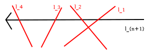

# 2.2.13

$$n$$本の直線を引いたときの領域の数を$$S(n)$$で表し、小さい$$n$$について試してみると以下のようになる。

|  $$n$$   |  0  |  1  |  2  |  3  |  4  |  5  | $$\cdots$$ |
| -------- | --- | --- | --- | --- | --- | --- | ---------- |
| $$S(n)$$ | 1   | 2   | 4   | 7   | 11  | 16  | $$\cdots$$ |

差を取ると$$n$$ずつ増えているので漸化式は$$S(n+1) = S(n) + n$$と表せる、つまり
$$S(n) = \frac{n(n+1)}{2} + 1$$と予想がつくのでそれを示す。

今、平面に$$n$$本の直線があり平面が$$S(n)$$個の領域に分割されているとする。
ここに1本新たに直線を追加することを考える。この追加した直線はいずれの直線とも平行でなく、また3点で交わることはないので$$n$$本の直線とちょうど1回ずつ交差する。

図のように今追加する直線を$$l_{n+1}$$とし、適当に$$l_{n+1}$$に向きをつけてもともと平面にあった直線を交わる順に$$l_1,l_2,\ldots,l_n$$としよう。
このとき、もともとどのように直線が交わっていたかに関係なく追加した直線は領域を$$n$$個増やす。
なぜなら両端以外では$$l_i,l_{i+1}$$と交わることでその2本の直線で交わっていた領域は2つに分断される。
また両端では片側が直線でもう片側が開いているだけなので、やはり同じようにもとの領域は2つに分断される。
よって$$n$$本の直線と交わることで領域がちょうど$$n$$個増えるので$$S(n+1)=S(n)+n$$が成り立つ。

